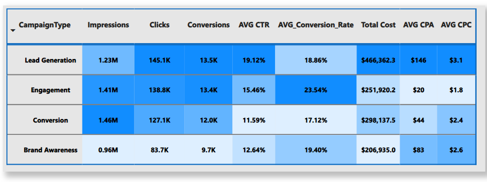

# Digital Marketing Campaign Analysis

## Overview
This project analyzes digital marketing campaign data to derive actionable insights and optimize campaign performance. The analysis includes key metrics such as impressions, clicks, conversions, CTR (Click-Through Rate), and CPA (Cost Per Acquisition) across different campaign types and platforms.

## Dataset
The dataset contains the following columns:
- **campaignID**: Unique identifier for each campaign
- **CampaignType**: Type of campaign (Brand Awareness, Lead Generation, Engagement, Conversion)
- **Platform**: Platform where the campaign was run (Facebook, LinkedIn)
- **StartDate**: Start date of the campaign
- **EndDate**: End date of the campaign
- **Days**: Duration of the campaign in days
- **Impressions**: Number of times the ad was displayed
- **CostPerClick**: Average cost per click
- **Conversions**: Number of conversions achieved
- **ConversionRate**: Percentage of clicks that converted
- **TotalCost**: Total cost of the campaign
- **CTR**: Click-Through Rate
- **CPA**: Cost Per Acquisition

## Tools used
 Power BI * *: to visualize data and create dashboard.

## Visualizations

---
## Charts and Analysis
### 1. Distribution of Total Cost and Conversions

**Description**: This chart shows how the total campaign costs , conversions, Total Clicks , Total Impressions and Avrage Cost Per Click (CPC)

**Key Metrics Analyzed**:
- Total Cost
- Avrage Cost Per Click (CPC)
- Total Conversions
- Total Clicks
- Total Impressions

**Thoughts**: For every 100 people who have seen the ad, approximately 10 have clicked on it, and only one has responded to the call to action. With a total campaign cost of $1.2 million and an average cost per click (CPC) of $2.4

### 2. Average CTR by Month and Platform

**Description**: This chart shows the average Click-Through Rate (CTR) for Facebook and LinkedIn campaigns each month.

**Key Metrics Analyzed**:
- Click-Through Rate (CTR)
- Month
- Platform (Facebook, LinkedIn)

**Thoughts**: There is a clear superiority of LinkedIn in the first quarter of the year. In June, the CTR ratio rises to the highest rate of the year for both platforms. Subsequently, there is a significant shift in performance between the two platforms, with notable differences.

---

### 3. Total Cost by Month and Platform

**Description**: This chart displays the total spending on campaigns for each month on both Facebook and LinkedIn.

**Key Metrics Analyzed**:
- Total Cost
- Month
- Platform (Facebook, LinkedIn)

**Thoughts**: With the previous line chart (AVG_CTR), we can now link the efficiency of the platform to the cost of the campaign. This provides a clear visual representation of how performance measures relate to expenditure over time. The higher the actual ratio (CTR), the greater the cost.

.png)

---

### 4. Campaign Type Performance

**Description**: This chart compares the performance of different campaign types (Brand Awareness, Lead Generation, Engagement, Conversion) based on key metrics like Impressions, Clicks, and Conversions.

**Key Metrics Analyzed**:
- Impressions
- Clicks
- Conversions
- Campaign Type

**Thoughts**:Here, we can discern several insights about each of the four campaigns:

Lead Generation: This campaign is widely effective and proliferative, though it incurs significant costs.

Engagement: Known for its widespread reach, low costs, and high effectiveness, engagement campaigns stand out as the most efficient.

Conversion: Despite its widespread adoption and relatively low costs, conversion campaigns are considered the least effective among the four.

Brand Awareness: While it is one of the least proliferative campaigns, brand awareness campaigns demonstrate good effectiveness at the lowest cost.

---

### 5. Platform Comparison

**Description**: This chart shows how Facebook and LinkedIn campaigns compare in terms of key metrics like Impressions, Clicks, and Conversions.

**Key Metrics Analyzed**:
- Impressions
- Clicks
- Conversions
- Platform (Facebook, LinkedIn)

**Thoughts**: These visuals indicate Facebook's superiority in terms of reach and engagement.

---

