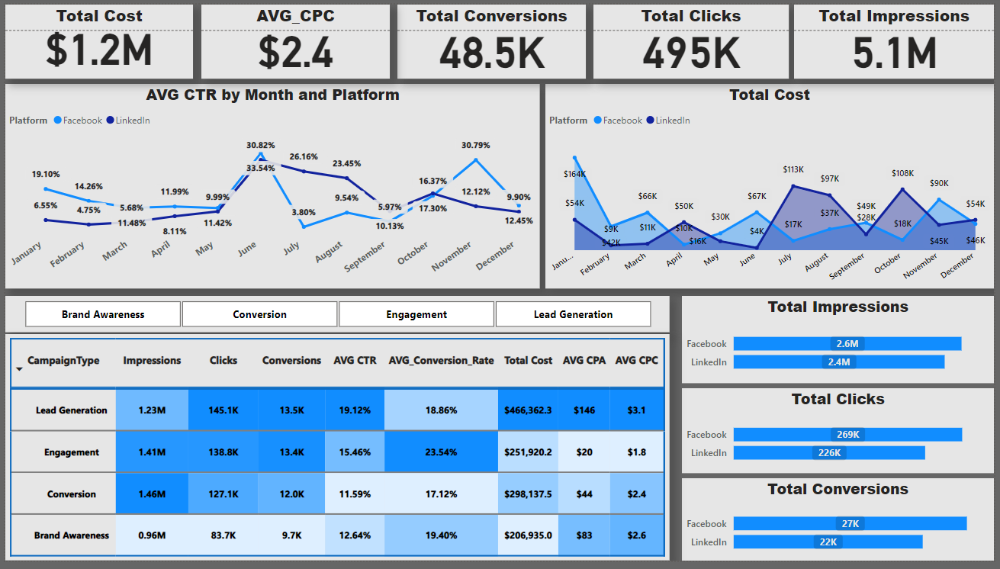
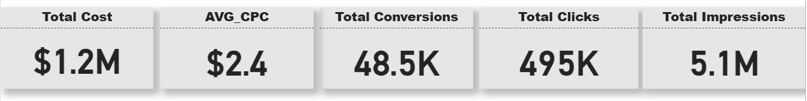
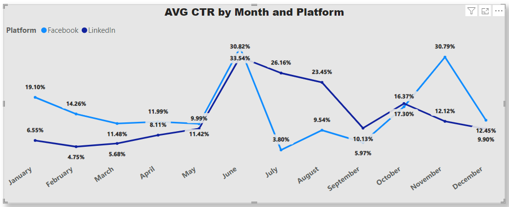
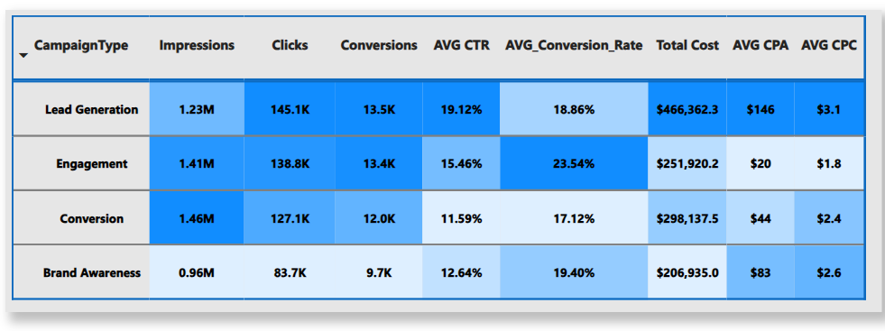
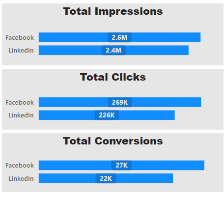

# Digital Marketing Campaign Analysis

## Overview
This project analyzes digital marketing campaign data to derive actionable insights and optimize campaign performance. The analysis includes key metrics such as impressions, clicks, conversions, CTR (Click-Through Rate), and CPA (Cost Per Acquisition) across different campaign types and platforms.

## Dataset
The dataset contains the following columns:
- **campaignID**: Unique identifier for each campaign
- **CampaignType**: Type of campaign (Brand Awareness, Lead Generation, Engagement, Conversion)
- **Platform**: Platform where the campaign was run (Facebook, LinkedIn)
- **StartDate**: Start date of the campaign
- **EndDate**: End date of the campaign
- **Days**: Duration of the campaign in days
- **Impressions**: Number of times the ad was displayed
- **CostPerClick**: Average cost per click
- **Conversions**: Number of conversions achieved
- **ConversionRate**: Percentage of clicks that converted
- **TotalCost**: Total cost of the campaign
- **CTR**: Click-Through Rate
- **CPA**: Cost Per Acquisition

## Visualizations

## Key Metrics Analyzed
1. **Total Cost**: $1.2M
2. **Average Cost Per Click (CPC)**: $2.4
3. **Total Conversions**: 48.5K
4. **Total Clicks**: 495K
5. **Total Impressions**: 5.1M

## Analysis and Insights
1. **Monthly Performance**:
    - Analysis of average CTR by month and platform to identify trends and peaks.
    - Monthly breakdown of total cost to monitor expenditure.

2. **Campaign Type Performance**:
    - Comparison of key metrics (Impressions, Clicks, Conversions, CTR, Conversion Rate, Total Cost, CPA, CPC) across different campaign types.

3. **Platform Comparison**:
    - Analysis of performance metrics between Facebook and LinkedIn to determine the more effective platform.

4. **Trend Analysis**:
    - Identification of seasonal trends and patterns to optimize future campaign strategies.

## Tools Used
- **Power BI**: For data visualization and dashboard creation.

## Conclusion
This analysis provides valuable insights into the performance of digital marketing campaigns. By understanding the trends and patterns in key metrics, businesses can optimize their marketing strategies, allocate budgets more effectively, and improve overall campaign performance.

# Digital Marketing Campaign Analysis

## Overview
This project analyzes digital marketing campaign data to derive actionable insights and optimize campaign performance.

## Dashboard Preview

## Dataset
The dataset contains the following columns:
- campaignID
- CampaignType
- Platform
- StartDate
- EndDate
- Days
- Impressions
- CostPerClick
- Conversions
- ConversionRate
- TotalCost
- CTR
- CPA

---

## Charts and Analysis
### 1. Distribution of Total Cost and Conversions

**Description**: This chart shows how the total campaign costs and conversions are distributed across different campaign types or platforms.

**Key Metrics Analyzed**:
- Total Cost
- Avrage Cost Per Click (CPC)
- Total Conversions
- Total Clicks
- Total Impressions

**Thoughts**: For every 100 people who have seen the ad, approximately 10 have clicked on it, and only one has responded to the call to action. With a total campaign cost of $1.2 million and an average cost per click (CPC) of $2.4

### 2. Average CTR by Month and Platform

**Description**: This chart shows the average Click-Through Rate (CTR) for Facebook and LinkedIn campaigns each month.

**Key Metrics Analyzed**:
- Click-Through Rate (CTR)
- Month
- Platform (Facebook, LinkedIn)

**Thoughts**: By observing the CTR trends, we can identify which months had the highest and lowest engagement, helping to pinpoint the most effective times for campaigns. Comparing Facebook and LinkedIn can reveal which platform performs better in terms of CTR.

---

### 3. Total Cost by Month and Platform

**Description**: This chart displays the total spending on campaigns for each month on both Facebook and LinkedIn.

**Key Metrics Analyzed**:
- Total Cost
- Month
- Platform (Facebook, LinkedIn)

**Thoughts**: Understanding monthly expenditure helps us see if increased spending correlates with better campaign performance. Comparing costs between Facebook and LinkedIn can help optimize future budget allocations.

.png)

---

### 4. Campaign Type Performance

**Description**: This chart compares the performance of different campaign types (Brand Awareness, Lead Generation, Engagement, Conversion) based on key metrics like Impressions, Clicks, and Conversions.

**Key Metrics Analyzed**:
- Impressions
- Clicks
- Conversions
- Campaign Type

**Thoughts**: This comparison helps identify which campaign types are most effective in achieving different goals. Knowing which types drive the most engagement or conversions can guide future campaign strategies.

---

### 5. Platform Comparison

**Description**: This chart shows how Facebook and LinkedIn campaigns compare in terms of key metrics like Impressions, Clicks, and Conversions.

**Key Metrics Analyzed**:
- Impressions
- Clicks
- Conversions
- Platform (Facebook, LinkedIn)

**Thoughts**: By comparing performance across platforms, we can see which platform delivers better results overall. This can inform decisions on where to focus more effort and budget.

---

### 6. Distribution of Total Cost and Conversions

**Description**: This chart shows how the total campaign costs and conversions are distributed across different campaign types or platforms.

**Key Metrics Analyzed**:
- Total Cost
- Conversions
- Campaign Type or Platform

**Thoughts**: Analyzing the cost and conversion distribution helps assess the cost-effectiveness of each campaign type or platform. It reveals whether we’re getting a good return on investment for each type of campaign.

